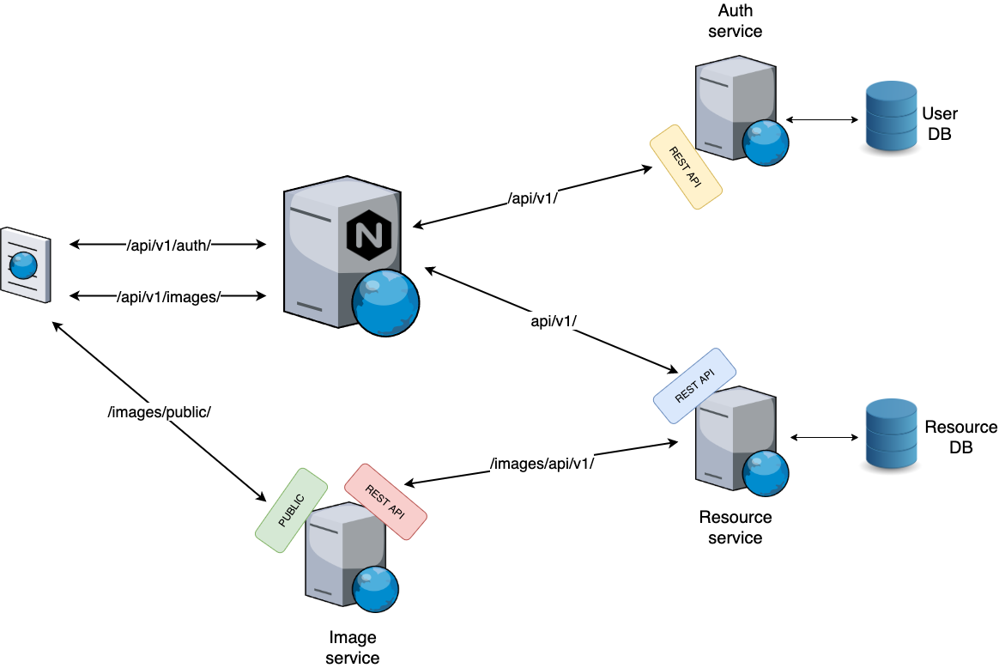
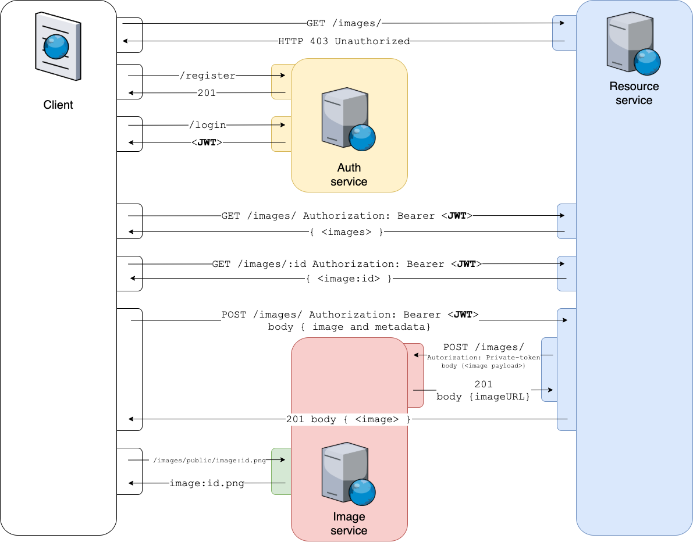

# Assignment B3 - Picture It

In this assignment, a system should be created consisting of two services (Auth and Resource) that need to be developed and one existing service (Image).

From the consumer's perspective, the API will have a single entry point even though it consists of multiple back-end services.

The system will handle images (called "resources") in a Restful manner through the use of three "microservices." No client application needs to be developed. Using Postman or Curl for checking the endpoints is enough. 

### System overview

_The image service is already deployed._

### Flow chart

0) The client tries to contact the resource service but gets a 403 back.
1) The client registers an account and logs in to the system. It will receive a JWT upon successful login.
2) Using the JWT as a Bearer token, the client can add, update and delete resources in the system.
3) When the client does a C- U- or D-request, the Resource service will send a request to the Image-service to add, delete or update an image. The Resource service stores the resources together with image "metadata." The Resource service responds to the client with the created document.
4) The client can request the image from the URL provided by the resource service.

## Auth service

The Auth service is a service that authenticates users and hands out JWT on login. The JWT handed out by the Auth-service should be validated and trusted by the Resource-service to use account information stored in the JWT without contacting the Auth-service.

Further information about this service can be found in [Auth Service](../../../../auth-service) and in #10.

## Resource service

This service will handle the resources in the overall application. In this case, this includes things like the user's image-URLs, image-descriptions, and image-title. The images will not be stored in this service, though. Instead, an external image service will be used to store the images. 

Further information about this service can be found in [Resource Service](../../../../resource-service) and in #11.

## Image service (existing)

This service will store all images that the application needs. This service is already deployed, and you find it at:
`https://courselab.lnu.se/picture-it/images/api/v1/`

In [its documenation](https://courselab.lnu.se/picture-it/images/api/v1/doc/) you will find out how to communicate with the service. Some things to note:

- Image data needs to be sent as a Base64-encoded string.
- The service communicates using an Access token. You will find the token in your "Secrets"-project.
- The service has a public interface on which it serves the images. Only the image URL is needed to be stored in the resource service.
- The payload to send to the server can not exceed 500kb. Yes, this means that only small images can be handled!

## This Project (Picture It)

No code needs to be written to this repo, but the "[assignment-routes.json](./assignment-routes.json)" needs to be completed so that it references the endpoints of the application. Only two places need to be corrected, the server-addresses (two places) and your student username (two places). It is on this repo the Merge Request to mark a submission of the assignment should be completed, not on the separate services!

Please use this repo for saving test data and files for other tools needed.

## Requirements

Make sure to read [all requirements of the application](../../issues/). This includes: (#1, #2, #3, #4, #5, #6, #7, #8, #9, #10, #11)
Pay extra attention to the labels indicating if the requirement is required (~"req::required") or optional (~"req::optional").

In this assignment, you are required to close issues and tasks ([ ]) that you implement. You are also required to create your own issues (and close them) for added functionality. 
